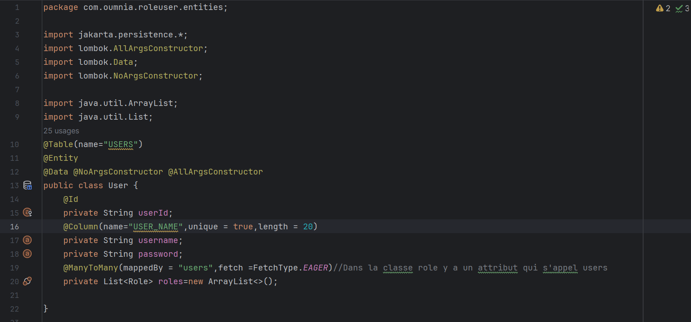

<h3>Compte Rendu 2ème Avtivité (ROLE-USER)<h3>
<h4>1-Creation de l'entité User</h4>

<h4>2-Creation de l'entité Role</h4>

<h4>3-Creation de Repository User</h4>

<h4>4-Creation de Repository Role</h4>

<h4>5-Creation de l'interface UserService</h4>

<h4>6-L'implementation de l'interface UserService</h4>

<h4>7-Configuration de fichier application.properties</h4>

<h4>8-Opérations de gestion</h4>
<h5>-----Ajouter-----</h5>
<h5>-----USERS-----</h5>

<h5>-----BD-----</h5>

<h5>-----ROLE-----</h5>

<h5>-----AFFECTER ROLE A UN USER-----</h5>

<h5>-----BD-----</h5>

<h5>-----AUTHENTIFICATION-----</h5>

<h4>9-Migration vers MYsql</h4>
<h5>-----application.propreties-----</h5>

<h5>-----Ajouter-----</h5>
<h5>-----Mysql-USERS-----</h5>

<h5>-----Mysql-ROLE-----</h5>

<h5>-----Mysql-Role_USER-----</h5>

<h4>10- JSON</h4>

